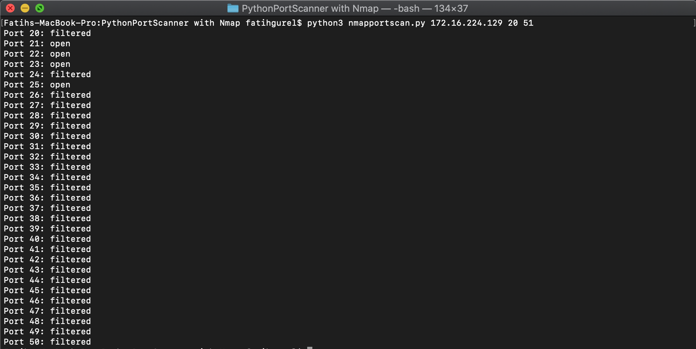

# PortScanner with PythonNmap

A simple port scanning tool developed with the Python Nmap module.

## Installation

```
git clone https://github.com/fatihgurel/PortScanner-with-PythonNmap.git

pip install -r requirements.txt
```
## Usage
Usage: python3 nmapportscan.py [IP] [RangeStart(port1) RangeEnd(port2)] 

## Example
Example: python3 nmapportscan.py scanme.nmap.org 21 53

